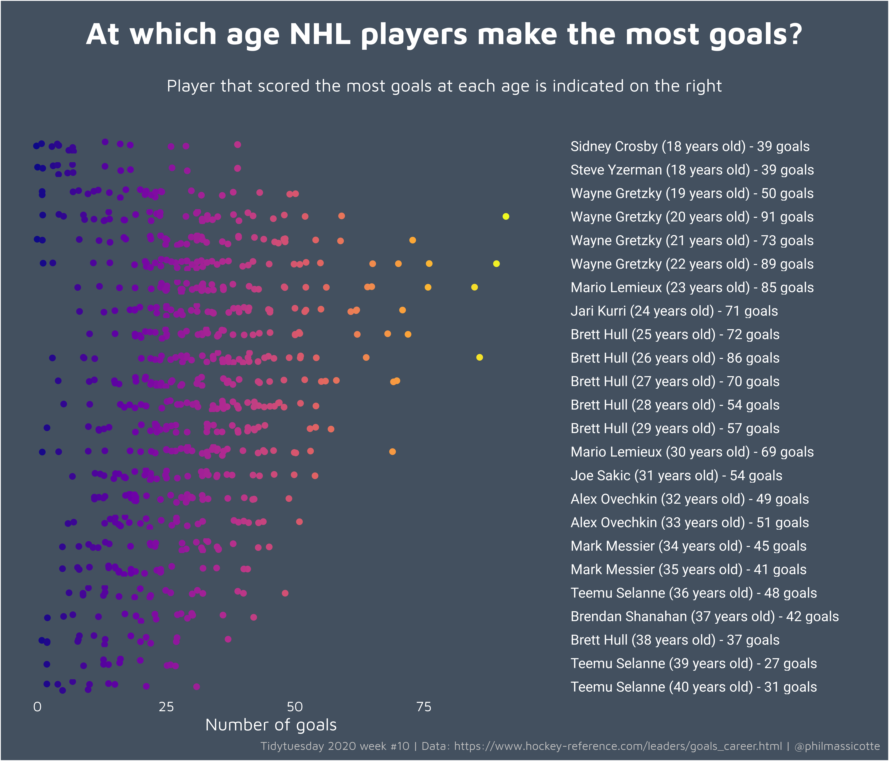

# Tidytuesday

My contributions to the [Tidytuesday](https://github.com/rfordatascience/tidytuesday) data visualization challenge.

> A weekly data project aimed at the R ecosystem. As this project was borne out of the `R4DS Online Learning Community` and the `R for Data Science` textbook, an emphasis was placed on understanding how to summarize and arrange data to make meaningful charts with `ggplot2`, `tidyr`, `dplyr`, and other tools in the `tidyverse` ecosystem. However, any code-based methodology is welcome - just please remember to share the code used to generate the results.

# 2019

## Week 31

## Week 32

## Week 33

## Week 47

## Week 49

## Week 51

## Week 52

# 2020

## Week 3

## Week 4

## Week 5 :evergreen_tree:

## Week 7

## Week 8

## Week 10

## Week 17

## Week 29

## Week 31

